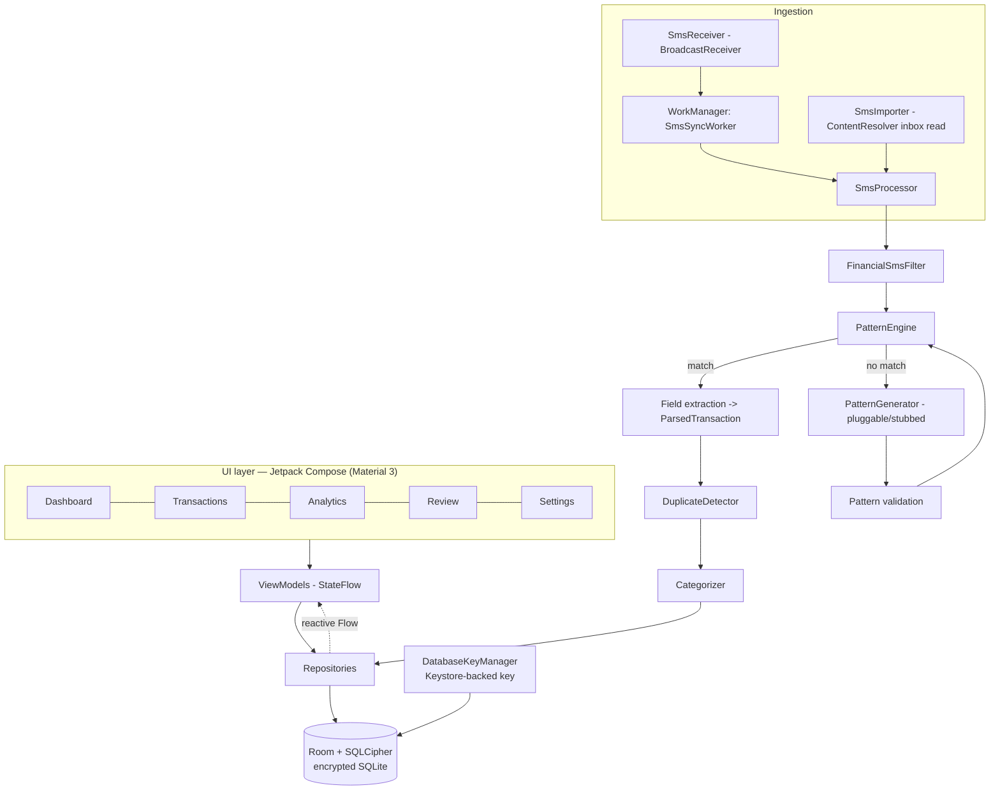
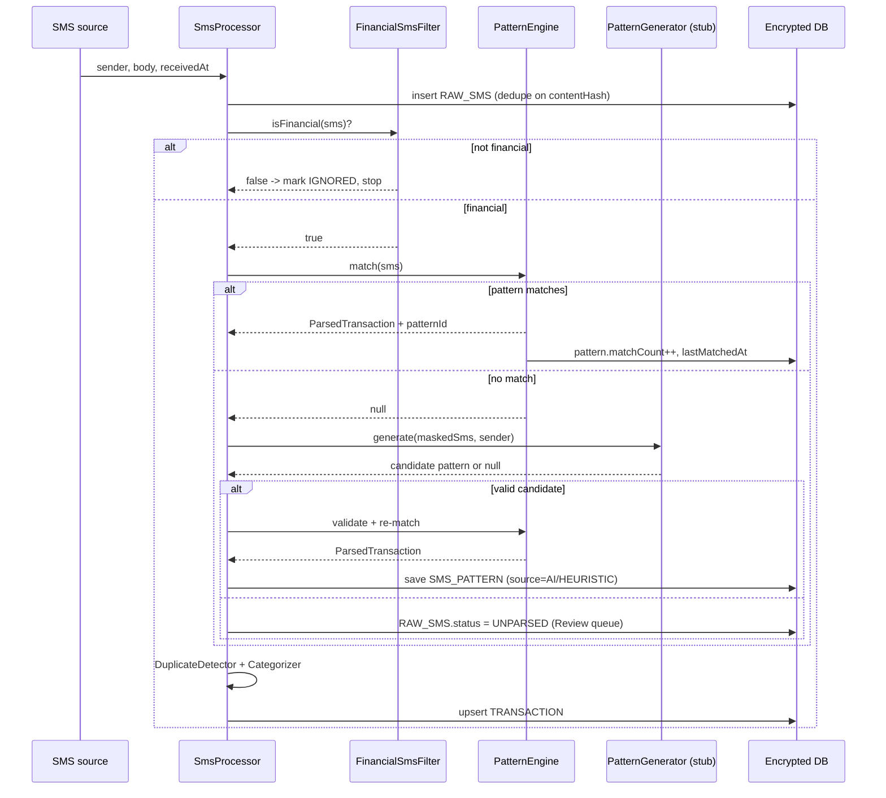
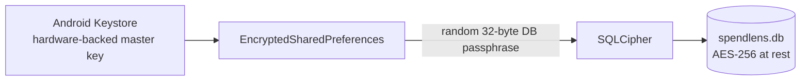

# SpendLens — Design & Architecture

This document maps the [requirements](REQUIREMENTS.md) to a concrete design: layering,
data model, the parsing/learning pipeline, duplicate detection, security, and the UI.

---

## 1. Architecture overview

MVVM with a thin repository layer over an encrypted Room database. The parser and
dedup logic are **pure Kotlin** (no Android imports) so they can be unit-tested on the JVM.



### Package layout (`com.spendlens.app`)

```
app/
  SpendLensApp.kt            Application: builds AppContainer, seeds patterns, schedules work
  MainActivity.kt            Single-activity host; Compose nav
  di/AppContainer.kt         Manual DI (no Hilt) — wires DB, repos, parser, AI
  data/
    db/                      Room: AppDatabase, DAOs, entities, type converters
    crypto/                  DatabaseKeyManager (Keystore + EncryptedSharedPreferences)
    repository/              TransactionRepository, PatternRepository, SettingsRepository
  sms/
    SmsReceiver.kt           BroadcastReceiver -> enqueue worker
    SmsImporter.kt           Reads existing inbox via ContentResolver
    SmsProcessor.kt          Orchestrates filter -> parse -> dedup -> categorize -> persist
  parser/                    PURE KOTLIN (JVM-testable)
    model/                   ParsedTransaction, TxnDirection, SmsPattern (domain)
    FinancialSmsFilter.kt    Cheap pre-filter
    PatternEngine.kt         Match SMS against patterns, extract fields
    BuiltinPatterns.kt       Seed pattern set (generic/multi-region)
    DuplicateDetector.kt     Dedup rules
    Categorizer.kt           Counterparty -> category
  ai/
    PatternGenerator.kt      interface (the pluggable slot)
    HeuristicPatternGenerator.kt  default, no network
    StubPatternGenerator.kt  returns null (pure pattern-only mode)
  work/SmsSyncWorker.kt      CoroutineWorker
  ui/
    theme/                   Color, Type, Theme (light/dark + dynamic color)
    nav/                     NavGraph, destinations
    screens/                 dashboard, transactions, analytics, review, settings, onboarding
    components/              charts (DonutChart, BarChart on Compose Canvas), cards, etc.
    viewmodel/
```

**Why manual DI (no Hilt):** fewer moving parts for review and a clean object graph
held by the `Application`. Easy to swap for Hilt later.

---

## 2. Data model (Room entities)

```mermaid
erDiagram
    RAW_SMS ||--o| TRANSACTION : "parses to"
    SMS_PATTERN ||--o{ TRANSACTION : "matched by"
    TRANSACTION }o--|| ACCOUNT : "belongs to"
    TRANSACTION }o--|| CATEGORY : "classified as"
    CATEGORY_RULE ||--o{ TRANSACTION : "categorizes"

    RAW_SMS {
        long id PK
        string sender
        string body
        long receivedAt
        string contentHash "sha-256, unique — idempotency"
        string status "PARSED | UNPARSED | IGNORED"
        long patternId FK "nullable"
    }
    SMS_PATTERN {
        long id PK
        string name
        string senderRegex "nullable"
        string bodyRegex "named groups"
        int priority "specificity; higher wins"
        string source "BUILTIN|AI|HEURISTIC|USER"
        bool enabled
        int matchCount
        long lastMatchedAt
        string sampleSms
    }
    TRANSACTION {
        long id PK
        long rawSmsId FK
        long amountMinor "integer minor units — no float money"
        string currency "ISO 4217"
        string direction "DEBIT | CREDIT"
        string accountKey "masked a/c or card tail"
        string counterparty
        long balanceMinor "nullable"
        string referenceId "nullable"
        long occurredAt
        string channel "UPI|CARD|ATM|NETBANKING|..."
        long categoryId FK
        string dupGroupId "nullable — links probable duplicates"
        bool isDuplicate
        bool userVerified
    }
    ACCOUNT { string accountKey PK; string label; string type }
    CATEGORY { long id PK; string name; string icon; string color }
    CATEGORY_RULE { long id PK; string matcher; long categoryId FK; string source }
```

**Money is never a float.** Amounts are stored as integer **minor units**
(`amountMinor`, e.g. cents/paise) with an ISO-4217 `currency`, to avoid rounding error.

`RAW_SMS.contentHash` (SHA-256 of `sender|body|receivedAt-day`) gives import idempotency
(FR-2.4) and exact-duplicate suppression (FR-7.3).

---

## 3. Parsing & learning pipeline

End-to-end flow for one message (new SMS or imported):



### 3.1 FinancialSmsFilter (cheap gate)
Rejects obvious non-financial SMS before any regex work:
- sender looks like a short-code / alphanumeric bank id (not a 10-digit personal number), **and**
- body contains a money cue (currency symbol/ISO code + number) **and** a transaction verb
  (`debited|credited|spent|withdrawn|received|paid|purchase|txn|transferred`).
- OTP-only / promotional messages are excluded (`OTP`, `do not share`, `offer`, `sale` without an amount+verb).

### 3.2 SmsPattern & PatternEngine
A pattern is a **named-group regex** over the body (+ optional sender regex):

```
(?i).*?(?<curr>INR|RS|USD|\$|€|£)\s?(?<amount>[\d,]+(?:\.\d{1,2})?)\s+
(?<dir>debited|credited|spent|withdrawn|received)\b.*?
(?:a/c|acct|card)\s*(?:no\.?)?\s*(?<account>[xX*\d]{2,})?.*?
(?:at|to|from|by|vpa)\s+(?<party>[A-Za-z0-9@.\- ]{2,40}).*?
(?:ref|txn|utr)[^\d]{0,4}(?<ref>[A-Za-z0-9]{6,}).*?
(?:avl|bal|balance)[^\d]{0,6}(?<balance>[\d,]+(?:\.\d{1,2})?)?
```

`PatternEngine.match()`:
1. Iterate enabled patterns ordered by `priority` desc, then `matchCount` desc.
2. First pattern whose `bodyRegex` (and `senderRegex`, if set) matches wins (short-circuit, NFR-2.3).
3. Map named groups -> `ParsedTransaction`, normalizing:
   - amount/balance -> integer minor units; currency symbol -> ISO code;
   - `dir` -> `DEBIT`/`CREDIT` (e.g. `spent|withdrawn|debited` -> DEBIT);
   - account -> masked key (keep last 4); `channel` inferred from keywords (`UPI`, `VPA`, `ATM`, `POS`, `card`).
4. **No match -> AI generation (3.4).**

`priority` encodes specificity: bank-/sender-specific learned patterns (higher) beat the
broad built-ins (lower), so the most specific match wins (FR-4.4).

### 3.3 Built-in pattern set (generic/multi-region)
Seeded on first run. Covers the common shapes regardless of bank:
debit/credit alerts, UPI sent/received, card spend, ATM withdrawal, salary/credit.
These are deliberately broad; learned patterns refine over time.

### 3.4 AI pattern generation (the pluggable, stubbed slot)
```kotlin
interface PatternGenerator {
    /** @param masked SMS body with PII masked; @return candidate or null */
    suspend fun generate(masked: String, sender: String): GeneratedPattern?
}
data class GeneratedPattern(val name: String, val bodyRegex: String,
                            val senderRegex: String?, val fieldNotes: String)
```
- **Default `HeuristicPatternGenerator` (no network):** tokenizes the message, locates the
  amount/verb/account/ref spans, and emits a regex by replacing those spans with the
  corresponding named groups and escaping the literal scaffolding. Gives real "learn a new
  format" behavior offline.
- **`StubPatternGenerator`:** returns `null` (pure built-in mode).
- **Future remote provider:** implement the same interface. **Masking (NFR-1.5) is applied
  before the text reaches `generate()`**, so a remote provider only ever sees the template.
- **Validation gate (FR-6.4):** candidate must compile, re-match its source SMS, and yield a
  plausible amount before it is persisted as a `SMS_PATTERN`. Saved patterns are reused for all
  later messages (FR-5.3).

Selection is config-driven in `AppContainer`; the app ships in stub/heuristic mode with **no
`INTERNET` permission** (NFR-1.4, AC-6).

---

## 4. Duplicate detection

`DuplicateDetector` runs after extraction, before persist:

1. **Exact:** if an existing `TRANSACTION` shares the `RAW_SMS.contentHash` lineage → drop (FR-7.3).
2. **Strong key:** same `amountMinor` + `accountKey` + `direction` + non-null equal `referenceId`
   → same event → mark as duplicate of the original, share a `dupGroupId`.
3. **Heuristic:** same `amountMinor` + `accountKey` + `direction`, `|Δ occurredAt| ≤ window`
   (default 180 s), and similar `counterparty` (normalized) → **flag** (not auto-delete) into the
   Review queue with a shared `dupGroupId` (FR-7.2/7.3).
4. User confirms-merge or rejects; decision is stored (FR-7.4).

All thresholds are constants in one place for tuning/testing.

---

## 5. Categorization
`Categorizer` maps normalized `counterparty` → `CATEGORY` via `CATEGORY_RULE` (seeded keyword
rules: e.g. `uber|ola|metro`→Transport, `swiggy|zomato|restaurant`→Food). A user re-categorization
writes a `USER` rule keyed by counterparty so it sticks (FR-8.2).

---

## 6. Background processing
- **New SMS:** `SmsReceiver` (manifest-registered, `BROADCAST_SMS` permission) does **no work**
  beyond enqueuing a `OneTimeWorkRequest` for `SmsSyncWorker` (avoids ANR/limits, FR-3.2).
- **Worker:** `CoroutineWorker` pulls pending raw SMS and runs the pipeline; idempotent with
  WorkManager retry/backoff (NFR-3.1).
- **Initial import:** a separate one-time worker streams the inbox in pages so a 5k-message
  import never blocks the UI (NFR-2.1).
- Reactive `Flow` from Room pushes results to ViewModels → Compose recomposes (FR-3.3).

---

## 7. Security design (NFR-1)



- **Encryption at rest:** SQLCipher (Zetetic `sqlcipher-android`) opens the Room DB with a
  256-bit passphrase. The passphrase is generated once with a CSPRNG and stored in
  `EncryptedSharedPreferences`, whose master key lives in the **Android Keystore**
  (`DatabaseKeyManager`). The passphrase never appears in code or logs.
- **No exfiltration:** no `INTERNET` permission in the on-device build; no telemetry SDKs;
  `allowBackup=false` + data-extraction rules exclude all data (NFR-1.3).
- **Least privilege:** SMS read/receive + notifications only.
- **PII masking** before any (future) external call (NFR-1.5).
- **Data lifecycle:** user-initiated export; delete-all wipes DB + keys (FR-11).

---

## 8. UI / UX design

### 8.1 Navigation
Single activity, bottom navigation: **Dashboard · Transactions · Analytics · Review · Settings**.
Onboarding/permission flow precedes the main graph until SMS access is granted.

### 8.2 Design system
- **Material 3**, dynamic color on Android 12+, hand-tuned light/dark fallback.
- Brand: deep teal `#0E7C66` (primary), warm gold `#FFD45E` (accent), debit/credit reds & greens
  chosen for AA contrast and color-blind safety (paired with icons/sign, not color alone).
- Typography scale from Material 3; tabular figures for money.

### 8.3 Screens
- **Dashboard:** month spend/income/net header, **donut** category chart, balance cards, recent list.
- **Transactions:** sticky search + filter chips (date/account/category/direction); grouped by day;
  duplicate badge; tap → detail with the source SMS and edit actions.
- **Analytics:** monthly **bar** trend, category breakdown, top merchants, debit-vs-credit.
- **Review:** unparsed SMS (with "teach a pattern" action) and flagged duplicate pairs.
- **Settings:** accounts, patterns (view/enable/delete), categories, privacy & data, re-scan.
- **Charts** are drawn on **Compose `Canvas`** (no third-party chart dependency) — keeps the
  dependency surface small and trusted (NFR-5.2). Vico/MPAndroidChart remain easy drop-ins later.

### 8.4 Key states
Every screen handles: permission-needed, empty, loading, populated, and error.

---

## 9. Testing strategy (NFR-5)
- **JVM unit tests** (no emulator): `FinancialSmsFilter`, `PatternEngine` (corpus of sample SMS →
  expected fields), `DuplicateDetector` (exact/strong/heuristic cases), amount/currency
  normalization, `HeuristicPatternGenerator` (generate → validate → re-match).
- **Room/DAO tests** (instrumented, in-memory SQLCipher) for idempotency and queries.
- **Golden SMS corpus** in `src/test/resources` — anonymized samples across formats/regions.
- A failing/odd SMS must never crash parsing (NFR-3.2) — fuzz a few malformed inputs.

---

## 10. Dependencies (trusted, pinned)
AndroidX Core/Lifecycle/Activity, Compose BOM + Material 3, Navigation-Compose, Room (+KSP),
WorkManager, `androidx.security:security-crypto`, Zetetic `sqlcipher-android`, Accompanist
Permissions, Kotlin Coroutines. All versions pinned in `gradle/libs.versions.toml`. **No AI/network
dependency in v1.**

---

## 11. Delivery phases
1. **Foundation** — project, encrypted DB, entities/DAOs, manual DI, theme/nav shell. *(scaffolding started)*
2. **Ingestion** — permissions/onboarding, inbox import, receiver + worker, idempotency.
3. **Parsing** — filter, built-in patterns, engine, normalization, persist (+ unit tests).
4. **Learning** — pattern store, heuristic generator + validation, Review/"teach" flow.
5. **Dedup & categorize** — detector, categorizer, merge UI.
6. **Analytics UI** — dashboard, transactions, analytics, charts.
7. **Hardening** — accessibility, performance, export/delete, test coverage, security pass.
